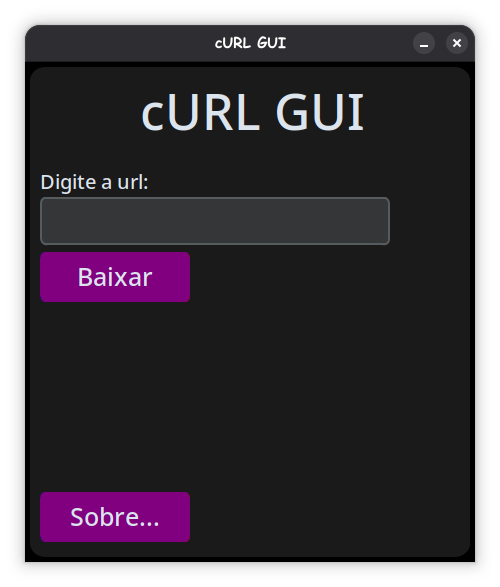
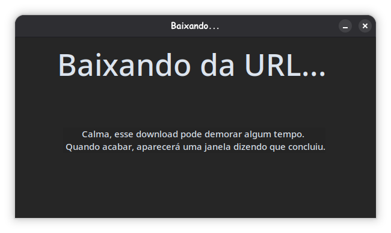
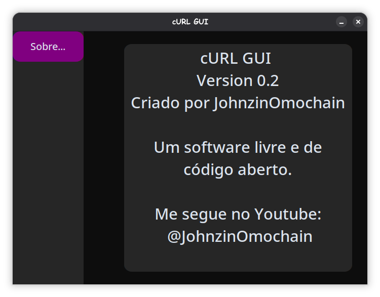

# cURL-GUI
Seja simples, rápido e funcional!
Uma interfaçe gráfica para o cURL (CLI Tool), que permite fazer o uso do cURL em algo muito mais fácil e eficiente. <br>
Feita em: Python (CustomTkinter e Subprocess) <br>
Em breve teremos um install.sh

## Como rodar:

### Passo 1
Instale o cURL no seu Linux. <br>
Ubuntu/Debian <br>
```
sudo apt install curl
```
Arch Linux <br>
```
sudo pacman -S curl
```

### Passo 2
Instale o customtkinter usando o pip <br>
```
pip install customtkinter
```
ou via AUR: <br>
```
yay -S python-customtkinter   #Yay
paru -S python-customtkinter    #Paru
```
### Passo 3
Rode ele usando: (python3 main.py) ou faça um atalho pra ele na área de trabalho <br>

## Screenshot
 <br>
<br>
<br>
